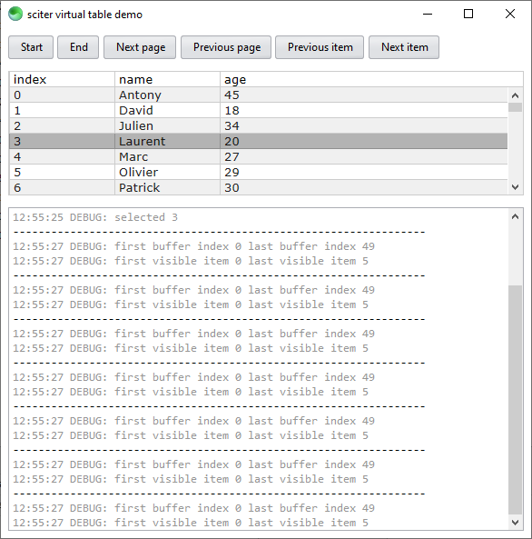
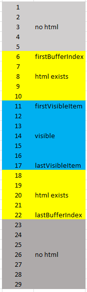

# sciter virtual table

Exploring [sciter.js](https://sciter.com/) virtual tables.

This project is derivated from the [virtual table example](https://github.com/c-smile/sciter-js-sdk/blob/main/samples.sciter/virtual-list/test-table.htm).

## demo

- git clone the repository
- on Linux/Mac `chmod +x install.sh start.sh`
- run `install.bat` (Win) or `./install.sh` (Linux/Mac) to download the latest sciter binaries and the sciter package manager
- install packages `php bin/spm.phar install`
- run `start.bat` (Win) or `./start.sh` (Linux/Mac)

## virtual list behavior

Assigning the `virtual-list` behavior adds the `vlist` object to the `body` element which has the following properties:

- `firstVisibleItem: Element`

first body element that is visible

- `lastVisibleItem: Element`

last body element that is visible

- `firstBufferIndex: int`

index of first element that is in memory

- `lastBufferIndex: int`

index of last element that is in memory

## how it actually works inside

